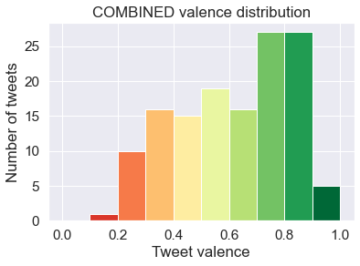
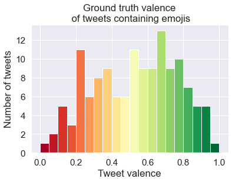
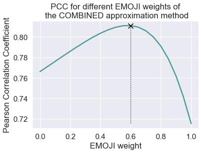

# EmojiSet
An open source tool to create labelled Twitter sentiment analysis data sets which include emojis.

We investigated how much the valence of the emojis in tweets as defined by a mapping correlates to the valence as approximated by VADER on the whole tweet. Essentially how well does only the emoji used capture the valence of the tweet?

See the notebook for more information with clear explanations!
